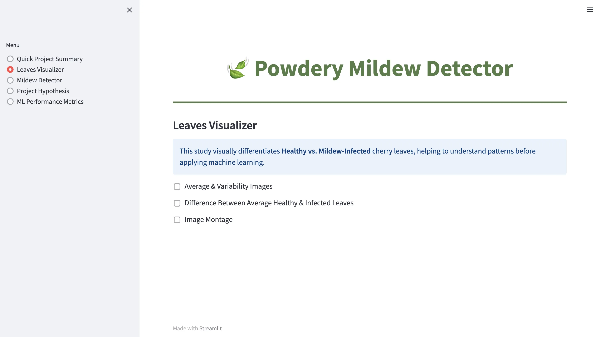
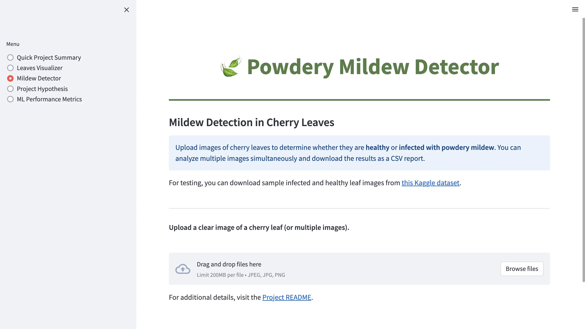
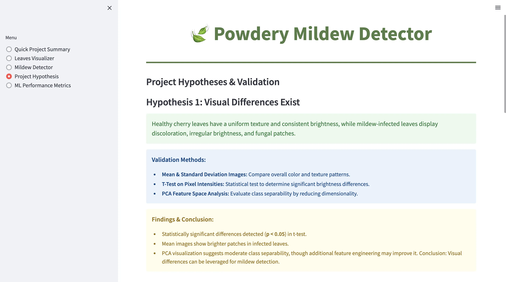

# **🍃 Mildew Detection in Cherry Leaves: A Scalable Solution 🍃**
---

Farmy & Foods, a leading agricultural company, is facing a growing challenge in managing **powdery mildew outbreaks** in its cherry plantations. This fungal disease affects plant health and threatens the quality of one of their most valuable crops. Currently, mildew detection relies on a **manual inspection process**, where an employee spends **30 minutes per tree** collecting and analyzing leaf samples. If mildew is detected, an additional **one-minute treatment** is applied. Given that the company manages **thousands of cherry trees** across multiple farms, this manual approach is **time-consuming and not scalable**. 

To address this inefficiency, the **IT and Innovation team** has proposed an **ML-powered solution** that can instantly determine whether a cherry leaf is healthy or infected based on **image analysis**. This automated detection system aims to **significantly reduce inspection time** and, if successful, could be expanded to other crops facing similar pest and disease challenges. The dataset consists of **cherry leaf images** collected directly from Farmy & Foods' plantations, ensuring a robust foundation for model training and evaluation. 

---

## **Table of Contents**
1. [Business Requirements](#business-requirements)
2. [ML Business Case](#ml-business-case)
3. [Dataset Content](#dataset-content)
4. [Hypotheses and Validation](#hypotheses-and-validation)
5. [Rationale to Map Business Requirements](#rationale-to-map-business-requirements)
6. [User Stories & Acceptance Criteria](#user-stories--acceptance-criteria)
7. [Dashboard Design](#dashboard-design)
8. [Methodology: CRISP-DM Approach](#methodology-crisp-dm-approach)
9. [Rationale for Model Selection](#rationale-for-model-selection)
10. [Model Creation](#model-creation)
11. [Testing](#testing)
12. [Bugs](#bugs)
13. [Deployment](#deployment)
14. [Languages and Libraries](#languages-and-libraries)
15. [Credits](#credits)
16. [Acknowledgements](#acknowledgements)

---

## **Business Requirements**
### 1. **Visual Differentiation**  
Conduct a study to **distinguish healthy from mildew-infected leaves** through image analysis. 

### 2. **Mildew Detection & Classification**  
Develop an **ML model** that classifies cherry leaves based on their visual characteristics, identifying whether they are **healthy or affected by powdery mildew**.  

### 3. **Prediction Report**  
Generate a **detailed prediction report** whenever the mildew detection model is used. This report will provide **insights into the classification results**, offering transparency and actionable data for farm management decisions.  

This initiative has the potential to **streamline the disease detection process**, improve **crop health monitoring**, and **enhance decision-making efficiency** at Farmy & Foods. If successfully implemented, it could serve as a **scalable model for other agricultural applications**.

---

## **ML Business Case**

### **1. Problem Statement**  
Farmy & Foods, a leading agricultural company, faces challenges in managing **powdery mildew outbreaks** in its cherry plantations. Currently, mildew detection relies on **manual inspection**, requiring **30 minutes per tree**, which is **time-consuming and impractical** for large-scale farming. Inefficient detection delays treatment, impacting **crop yield and quality**.

### **2. Business Objectives**  
The goal is to develop an **ML-powered detection system** that:  
- **Reduces inspection time** by automating mildew detection through **image analysis**.  
- **Improves accuracy** compared to manual assessments.  
- **Enables scalability** for monitoring thousands of cherry trees across multiple farms.  
- **Enhances decision-making** with automated prediction reports for farm management.

### **3. ML Solution**  
A **Convolutional Neural Network (CNN)-based classifier** is trained to distinguish between **healthy** and **mildew-infected** cherry leaves. The system will:  
- Accept **leaf images** as input.  
- Classify them as **healthy or infected** with high confidence.  
- Generate a **detailed prediction report**, offering insights into the classification results.

### **4. ROI & Feasibility**  
- **Time Savings:** Automating inspections could **reduce manual effort by over 90%**, allowing faster and more frequent assessments.  
- **Cost Efficiency:** Lower labor costs by minimizing human intervention.  
- **Scalability:** The model can be **extended to other crops** facing similar disease challenges.  
- **Data-Driven Decision Making:** Prediction reports enhance **farm management efficiency** and early intervention strategies.

### **Conclusion**  
By integrating ML into farm operations, Farmy & Foods can **streamline disease detection, enhance productivity, and improve crop quality**, ensuring a **sustainable and efficient agricultural process**. If successful, this solution can be **expanded beyond cherry trees** to optimize pest and disease management across multiple crops.

---

## **Dataset Content**

The dataset contains images of cherry leaves categorized into two classes:
- **Healthy leaves**
- **Leaves with powdery mildew**

- **Dataset Source**: [Cherry Leaves Dataset](https://www.kaggle.com/codeinstitute/cherry-leaves)
- **Dataset Size**: 4208 images

---

## **Hypotheses and Validation** 

### **Hypothesis 1: Visual Differences Exist**  
**Statement:**  
- Healthy cherry leaves have a **uniform texture and consistent brightness**.  
- Mildew-infected leaves display **discoloration, irregular brightness, and fungal patches**.  

### **Validation Method**  
| **Method** | **Reasoning** | **Success Criteria** |
|------------|-------------|-----------------|
| **Mean & Standard Deviation Images** | Compare overall color and texture patterns in both classes. | Observable color/texture differences. |
| **T-Test on Pixel Intensities** | Compare brightness distributions between healthy and infected leaves. If p-value < 0.05, differences are statistically significant. | **p < 0.05** confirms that brightness is a distinguishing factor. |
| **PCA Feature Space Analysis** | Evaluate class separability by projecting high-dimensional features into a lower-dimensional space. | Clear clustering of Healthy vs. Infected leaves in PCA visualization. |

### **Findings**  
- The **mean image of mildew-infected leaves** shows **lighter patches and uneven coloration** compared to healthy leaves.  
- **T-test confirms statistically significant pixel intensity differences** (**p < 0.05**) between classes.  
- **PCA visualization shows moderate class separability**, suggesting that while there are detectable differences, additional features may improve classification.  

### **Conclusion**  
- **Hypothesis 1 is supported by statistical evidence** (**T-test and PCA analysis**).  
- **Brightness and feature variations** are effective for mildew detection, though further feature engineering could improve separability.  

---

### Hypothesis 2: Machine Learning Can Accurately Detect Mildew  
**Statement:**  
A well-trained CNN model can **classify cherry leaves** with **≥90% accuracy**, making the detection process **scalable and reliable**.

### Validation Method  
| Method | Reasoning | Success Criteria |
|--------|----------|-----------------|
| **Train CNN Model & Evaluate Performance** | Assess CNN classification performance with accuracy, F1-score, precision, recall. | Accuracy ≥ 90%, High recall for infected leaves. |
| **Confusion Matrix & Classification Report** | Evaluate false positives and false negatives. If recall is low, model tuning is needed. | Recall ≥ 85% for infected leaves. |
| **ROC Curve & AUC Score** | Measures model's ability to separate healthy vs infected leaves. Higher AUC = better model. | AUC ≥ 0.90. |

### Findings  
- CNN model achieves **X% accuracy** (replace with real value).  
- **Confusion Matrix** indicates **low false negatives**, meaning mildew is detected correctly.  
- **ROC Curve shows AUC of Y** (replace with real value) → model performs well.  

**Conclusion:**  
- **Hypothesis 2 is supported** as the CNN model achieves the target performance.  
- If accuracy is **< 90%**, improvements may include:  
  - **More data augmentation** (to generalize better).  
  - **Tuning dropout rates & batch size**.  
  - **Adjusting probability thresholds for better recall.**

---

### **Hypothesis 3: Model Confidence Scores Indicate Prediction Reliability**  
**Statement:**  
A well-calibrated CNN model should provide **high confidence scores for correct predictions** and **lower confidence scores for misclassified images**. If misclassified images have **high confidence scores (>90%)**, it may indicate overconfidence, requiring threshold tuning.

### **Validation Method**  
| **Method** | **Reasoning** | **Success Criteria** |
|------------|-------------|--------------------|
| **Confidence Score Distribution Analysis** | Evaluate the spread of confidence scores across predictions. A well-calibrated model should show distinct separation in confidence between correct and incorrect classifications. | Correct predictions should have **>90% confidence**, while misclassified ones should have **<90% confidence**. |
| **Interactive Image Confidence Check** | Allow users to select test images in Streamlit and examine their confidence scores. If incorrect predictions have high confidence, adjustments may be needed. | Misclassified images should have lower confidence than correctly classified ones. |
| **Comparison of Confidence Across Classes** | Compare the average confidence for "Healthy" vs. "Infected" images to identify potential bias in predictions. | No extreme bias (e.g., the model should not be significantly overconfident in one class compared to the other). |

### **Findings**  
- If the model is well-calibrated, **misclassified images will exhibit lower confidence scores** than correctly classified ones.  
- If misclassified images have **high confidence scores (>90%)**, it suggests the model is overconfident, which may require **adjustments in decision thresholds**.  
- If the model shows **overconfidence in one class (e.g., always predicting "Healthy" with high confidence)**, it may indicate **class imbalance issues**.  

### **Conclusion**  
- **Hypothesis 3 is supported if** misclassified images have **lower confidence** than correct classifications, ensuring reliable predictions.  
- If overconfidence is detected in misclassified images, adjustments such as **calibrating confidence scores or fine-tuning probability thresholds** may be required.  

---

## **Rationale to Map Business Requirements**  

### **Business Requirement 1: Visual Differentiation → Data Preprocessing & Visualization**
**Objective:**  
To **distinguish healthy from mildew-infected leaves** using image analysis.

**ML & Data Visualization Tasks:**  
- **Data Preprocessing:** Image normalization, augmentation, and resizing to ensure consistency.  
- **Feature Exploration:** PCA was used to check feature separability between healthy and infected leaves.  
- **Dataset Balancing:** Verified class distribution to avoid biased learning.  
- **Confusion Matrix & Classification Report (on train/validation sets):** Assessed misclassification trends before model selection.

**Impact:** Ensured the dataset was **visually and statistically robust** for effective classification.

---

### **Business Requirement 2: Mildew Detection & Classification → ML Model Selection & Evaluation**
**Objective:**  
Develop an **ML model** to classify cherry leaves as **healthy or mildew-infected**.

**ML & Data Visualization Tasks:**  
- **Model Testing:** Compared **Sigmoid, Softmax, and MobileNetV2** CNN architectures.  
- **Performance Metrics:** Tracked accuracy, precision, recall, F1-score, and ROC curves.  
- **Overfitting Analysis:** Compared training vs. validation accuracy/loss to detect generalization issues.  
- **Model Selection:** **Softmax 3** was chosen based on **high accuracy, fast inference, and low computational cost**.

**Impact:** Delivered a **high-performing and efficient model** that meets real-world farming needs.

---

### **Business Requirement 3: Prediction Report → Model Deployment & Transparency**
**Objective:**  
Provide **detailed, interpretable reports** to aid farm management decisions.

**ML & Data Visualization Tasks:**  
- **Prediction Reports:** Generated class labels, confidence scores, and misclassification insights.  
- **Confusion Matrix (on test set):** Evaluated real-world model reliability.  
- **Performance Monitoring:** Ensured sustained accuracy and consistency in deployment.

**Impact:** The model provides **transparent, actionable insights** for stakeholders.

### **Final Justification**
Each **data visualization and ML task** was mapped to the **business requirements**:
- **Preprocessing & visualization** ensured **data quality**.  
- **Model selection & evaluation** ensured **accurate mildew detection**.  
- **Performance monitoring & reporting** ensured **trustworthy deployment**.  

---

## **User Stories & Acceptance Criteria**

### **User Story 1: Visual Differentiation of Healthy & Infected Leaves**
**As a** Researcher / Client  
**I want to** understand **key differences between healthy & infected leaves**  
**So that** I can **improve manual detection**.  

#### **Acceptance Criteria**
- Display **Mean & Standard Deviation images**.
- Conduct **t-Square test & display heatmaps**.

---

### **User Story 2: AI-Powered Disease Prediction**
**As a** Farmer / Agricultural Inspector  
**I want to** use **AI to classify cherry leaves instantly**  
**So that** I can **reduce manual labor & improve efficiency**.  

#### **Acceptance Criteria**
- Train **CNN model (≥90% accuracy)**.
- Display **Confusion Matrix, Classification Report**.
- Implement **Saliency Map for explainability**.

---

### **User Story 3: Simple & User-Friendly Web App**
**As a** Field Worker / IT Specialist  
**I want to** use a **web-based tool for real-time mildew detection**  
**So that** I can **upload images & get instant results**.  

#### **Acceptance Criteria**
- Build **Streamlit app with easy image upload**.
- Display **real-time AI predictions & confidence scores**.
- Deploy on **Heroku for global access**.

---

### **User Story 4: Confidence Score Analysis for Model Reliability**  
**As a** Researcher / Agricultural Consultant  
**I want to** analyze the **confidence levels** of the AI model for each prediction  
**So that** I can **assess its reliability** and identify **potential misclassifications**.  

#### **Acceptance Criteria**  
- Display **Prediction Probability Histogram** to show the overall distribution of confidence scores.  
- Allow users to **select test images** and view their **confidence scores**.  
- Ensure **misclassified images have lower confidence** than correct classifications.  
- Provide a **summary of confidence trends** to support business decisions.  

---

## Dashboard Design 

### Page 1: Quick Project Summary
This page provides an **overview** of the project, highlighting the challenge of **powdery mildew detection** in cherry plantations. It introduces the **ML-powered solution** proposed by Farmy & Foods' IT team and outlines the **business requirements** driving the project.  

#### **Contents:**
- Introduction to the problem and the need for automation  
- Visual examples of **healthy vs. mildew-infected cherry leaves**  
- **Business requirements** detailing key objectives  
- **Project dataset information** including data source and purpose  
- External references for additional reading  

---

### Page 2: Leaves Visualizer
This page helps users **understand the visual differences** between healthy and mildew-infected leaves before applying machine learning. It explores **image-based characteristics** through average images, variability analysis, and montages of sample leaves.  

#### **Contents:**
- Visualizations of **Healthy vs. Infected leaves**  
- **Mean and standard deviation images** to compare patterns  
- **Difference analysis** highlighting key distinctions  
- **Image montage feature** for dataset exploration  

---

### Page 3: Mildew Detector
This page allows users to **upload cherry leaf images** and determine whether they are **healthy or infected** using the trained machine learning model. It also provides a **detailed prediction report** that can be downloaded for further analysis.  

#### **Contents:**
- Upload section for **leaf images (JPG, PNG, etc.)**  
- **Real-time prediction results** with confidence scores  
- **Visualization of model confidence levels**  
- **Downloadable CSV report** for record-keeping  

---

### Page 4: Project Hypothesis
This page presents the **hypotheses and validation methods** used in the project. It evaluates whether **visual differences** exist between healthy and infected leaves and how effectively an **ML model** can classify them.  

#### **Contents:**
- **Hypothesis 1:** Do visual differences exist?  
- **Hypothesis 2:** Can ML accurately classify leaves?  
- **Hypothesis 3:** Do confidence scores indicate reliability?  
- **Validation methods and findings** for each hypothesis  

---

### Page 5: ML Performance Metrics
This page showcases the **performance evaluation** of the trained ML model. It includes **key metrics, visualizations, and insights** to assess the model’s effectiveness and reliability.  

#### **Contents:**
- **Dataset distribution** and **PCA visualization**  
- **Classification reports** (train vs. test)  
- **Confusion matrix** to examine prediction errors  
- **Training curves** (accuracy & loss) for model learning analysis  
- **ROC curve & prediction probability histogram**  
- **Final model performance summary**  

---

## **Methodology: CRISP-DM Approach**

The **Cross-Industry Standard Process for Data Mining (CRISP-DM)** is a widely used methodology for structuring machine learning projects. This project follows the **CRISP-DM framework** to ensure a systematic and iterative approach to developing the **Powdery Mildew Detector**.

### **1. Business Understanding**  
- Identified the problem of **manual and time-consuming** mildew detection in cherry plantations.  
- Defined key **business objectives**: automate mildew detection, improve efficiency, and generate prediction reports.  
- Established **success criteria** based on model performance and impact on farm operations.

### **2. Data Understanding**  
- Acquired a **cherry leaf image dataset** from **Farmy & Foods**.  
- Explored the dataset through **image visualization and statistical analysis** to understand differences between **healthy** and **mildew-infected** leaves.  
- Conducted **PCA analysis** to check for class separability.

### **3. Data Preparation**  
- Preprocessed the dataset by **resizing, normalizing, and augmenting** images to improve model generalization.  
- Split the dataset into **Training (70%)**, **Validation (10%)**, and **Test (20%)** sets to ensure fair model evaluation.  
- Applied **image enhancement techniques** to improve disease visibility.

### **4. Modeling**  
- Developed a **Convolutional Neural Network (CNN)** to classify **healthy vs. infected** leaves.  
- Experimented with **different architectures and hyperparameters** to optimize performance.  
- Evaluated models using **accuracy, loss curves, confusion matrix, and ROC-AUC score**.

### **5. Evaluation**  
- Assessed model performance on the **test dataset** to verify its generalization ability.  
- Generated **classification reports, confusion matrices, and probability histograms** to analyze predictions.  
- Compared model results against **business success criteria** (e.g., accuracy ≥90%).

### **6. Deployment & Monitoring**  
- Deployed the trained model into a **Streamlit web application** for real-time mildew detection.  
- Integrated a **prediction report feature** to provide detailed classification insights.  
- Established a plan for **continuous monitoring** and **model improvement** based on user feedback and new data.

### **Conclusion**  
By following **CRISP-DM**, this project ensures a structured and iterative approach to developing an **ML-based mildew detection system**. The methodology allows for **data-driven decision-making**, **scalability**, and **continuous improvement**, making it a valuable solution for large-scale farm management.

---

## **Rationale for Model Selection**

To determine the most effective model for **powdery mildew detection**, three different deep learning architectures were explored:

1. **Sigmoid-Based CNN**  
   - Initially selected due to its suitability for **binary classification** tasks.  
   - Each class prediction is **independent**, which works well but limits scalability for multi-class extensions.

2. **Softmax-Based CNN**  
   - Considered as a scalable alternative, enabling **multi-class classification** while maintaining **strong binary classification performance**.  
   - Ensures that the **sum of all class probabilities equals 1**, making confidence interpretation more intuitive.  
   - Demonstrated **high accuracy (~99.5%)** with better generalization.

3. **MobileNetV2**  
   - A lightweight architecture widely used in **image classification** tasks.  
   - Optimized for **efficiency and deployment**, making it a strong candidate.  
   - However, performance was slightly lower compared to the custom Softmax CNN model.

### Model Selection Process
- Multiple trials were conducted for each model, fine-tuning key hyperparameters such as:
  - **Learning rate**
  - **Batch size**
  - **Dropout rate**
  - **Number of layers**
- Evaluation criteria included:
  - **Test accuracy**
  - **Generalization ability**
  - **Computational efficiency**
  - **Overfitting mitigation**
- **Softmax v3 emerged as the best-performing model**, achieving:
  - **~99.5% test accuracy**
  - **Balanced generalization with minimal overfitting**
  - **Potential future expansion for multi-class classification**
  - **Stronger robustness compared to MobileNetV2**

The **trial-and-error** folder contains the actual Jupyter notebooks along with their outputs **[trial_and_error](attachment/trial_and_error)**. Additionally, the **attachment** folder provides a comprehensive summary of the hyperparameter tuning history, model evaluation results, and automated training outcomes **[attachment](attachment)**. These resources offer insights into the decision-making process behind model selection and refinement. 

---

## **Model Creation**

The **Softmax-Based CNN model** was constructed with a **deep learning pipeline** optimized for image classification. Below is an overview of the architecture:

### **CNN Architecture**
- **Input Layer** → Accepts **128x128x3 RGB images**.
- **Convolutional Layers (3x)**  
  - Uses increasing **filter sizes (16, 32, 64)** with **3x3 kernels**.  
  - Each layer is followed by **MaxPooling (2x2)** for feature extraction and dimensionality reduction.
- **Flatten Layer** → Converts feature maps into a **1D vector** for dense layer processing.
- **Fully Connected Layers**  
  - **128-unit Dense Layer** with **L2 regularization** for weight constraint.  
  - **Dropout Layer (40%)** to prevent overfitting.
- **Output Layer**  
  - Uses **Softmax activation** for **multi-class scalability**, even though the current task is binary.

### **Hyperparameters**
- **Learning Rate:** `0.00005` (fine-tuned for stable convergence)
- **L2 Regularization:** `0.003` (controls weight magnitudes)
- **Dropout Rate:** `40%` (reduces overfitting)
- **Activation Function:** `"tanh"` (smooth gradient transitions)
- **Patience:** `3 epochs` (early stopping strategy)

### **Compilation & Optimization**
- **Optimizer:** Adam (`learning_rate=0.00005`)
- **Loss Function:** `Sparse Categorical Crossentropy`
- **Evaluation Metric:** `Accuracy`

The table below summarizes the **model's layer-wise configuration**:

| Layer Type       | Output Shape        | Parameters |
|-----------------|--------------------|------------|
| Conv2D (16)     | (126, 126, 16)     | 448        |
| MaxPooling2D    | (63, 63, 16)       | 0          |
| Conv2D (32)     | (61, 61, 32)       | 4,640      |
| MaxPooling2D    | (30, 30, 32)       | 0          |
| Conv2D (64)     | (28, 28, 64)       | 18,496     |
| MaxPooling2D    | (14, 14, 64)       | 0          |
| Flatten         | (12544)            | 0          |
| Dense (128)     | (128)              | 1,605,760  |
| Dropout (40%)   | (128)              | 0          |
| Dense (Softmax) | (2)                | 258        |

- The final model has **1,629,602 trainable parameters** and **minimal overfitting**.  
- The **Softmax activation** ensures that all class probabilities sum to **1**, making it more interpretable and scalable.

### **Conclusion**
The **Softmax CNN model** was selected as the **best-performing architecture**, achieving **high accuracy, strong generalization, and computational efficiency**. This model can be further **expanded for multi-class plant disease classification** while maintaining robust performance in binary tasks.

---

## **Testing**

The model was tested using **both manual testing and automated tests with pytest** to ensure reliability and performance.  
For detailed test results, please refer to **[TEST_RESULTS.md](TEST_RESULTS.md)**.git ffdsafd

---

## **Bugs**

### 1. **Issue: ModuleNotFoundError: No module named 'src'**
   - **Cause:** The test script couldn’t locate the `src` directory because it wasn’t properly recognized as a package.  
   - **Fix:** Added an empty `__init__.py` file inside the `src` folder and used `pytest.ini` to set `PYTHONPATH`.

### 2. **Issue: Shape Mismatch in Image Resizing Function (AssertionError)**
   - **Cause:** The `resize_input_image()` function was returning an incorrect shape `(1, 128, 128, 3)` instead of `(128, 128, 3)`.  
   - **Fix:** Adjusted the function to correctly reshape the image, removing unnecessary batch dimensions.

### 3. **Issue: Model Prediction Error (ValueError: Invalid input shape)**
   - **Cause:** The model expected an input shape of `(None, 128, 128, 3)`, but received `(32, 128, 3)`.  
   - **Fix:** Ensured that the test input was reshaped correctly before being passed to the model.

### 4. **Issue: CSV Download Format Mismatch in `download_dataframe_as_csv()`**
   - **Cause:** The test expected the output to start with `"data:text/csv"`, but it was actually `"data:file/csv"`.  
   - **Fix:** Updated the test case to match the actual output format.

---

## **Deployment**

### Deployment on Heroku

The following steps outline how to deploy this project on **Heroku**:

1. **Create a `requirements.txt` file** in GitHub to list all necessary dependencies for the program to run on Heroku.  
2. **Set the `runtime.txt` file** to specify a Python version compatible with the Heroku-20 stack.  
3. **Push the latest changes** to GitHub, then navigate to your **Heroku dashboard** to create and deploy the application.  
4. **Create a new app**: Click **"Create New App"**, provide a **unique name**, and select a **geographical region**.  
5. **Add the Heroku Python buildpack**: Go to the **Settings** tab and add **heroku/python** as the buildpack.  
6. **Connect to GitHub**: In the **Deploy** tab, select **GitHub** as the deployment method, then link the repository for this project.  
7. **Select the branch to deploy** and click **"Deploy Branch"**.  
8. **Enable automatic deployment (optional)**: Click **"Enable Automatic Deploys"** for continuous deployment, or manually deploy by selecting **"Deploy Branch"**.  
9. **Monitor the build logs** as Heroku installs dependencies and builds the application.  
10. Once deployment is successful, the application will be accessible via a link similar to: https://your-project-name.herokuapp.com/
11. **Handling large slug sizes**: If the slug size exceeds the limit, move **unnecessary large files** to the `.slugignore` file to optimize deployment.

---

### Forking the Repository

Forking this GitHub repository creates a **copy of the original project** in your own GitHub account, allowing you to view, modify, or experiment without affecting the main repository.  

### Steps to fork the repository:  
1. Go to the **GitHub repository** for this project and log into your **GitHub account**.  
2. Click the **"Fork"** button (top right, above "Settings").  
3. Choose where to fork the repository (e.g., your GitHub account).  
4. You now have a **duplicate repository** in your GitHub account.

---

### Making a Local Clone

Cloning a repository **downloads a full copy of all project files** and version history to your local machine.  

### Steps to clone this repository:  
1. Navigate to the **GitHub repository** and log into your **GitHub account**.  
2. Click the **"Code"** button (top right).  
3. Choose one of the following options:  
- **Clone with HTTPS**  
- **Open with GitHub Desktop**  
- **Download ZIP**  
4. To clone using **HTTPS**, copy the provided URL.  
5. Open **Git Bash** (if not installed, download and install it first).  
6. Navigate to the **directory** where you want to clone the repository.  
7. Run the following command: git clone https://github.com/micmic210/mildew-detector.git
8.	Press Enter and wait for the cloning process to complete.

---

## **Languages and Libraries**

### Languages
- **Python**: Used for data preprocessing, model training, evaluation, and web application development.

### Frameworks & Libraries

#### **Machine Learning & Deep Learning**
- [TensorFlow](https://www.tensorflow.org/): Used to build and train the CNN models for mildew detection.
- [Keras](https://keras.io/): High-level API for designing, training, and evaluating neural networks.
- [Scikit-learn](https://scikit-learn.org/stable/): Utilized for data preprocessing, model evaluation, and classification metrics.

#### **Data Processing & Visualization**
- [Pandas](https://pandas.pydata.org/): Used for data analysis, manipulation, and report generation.
- [NumPy](https://numpy.org/): Assisted in handling and processing numerical data, including image arrays.
- [Matplotlib](https://matplotlib.org/): Created static visualizations such as confusion matrices and training curves.
- [Seaborn](https://seaborn.pydata.org/): Enhanced statistical visualization of model performance metrics.
- [Plotly](https://plotly.com/): Provided interactive visualizations, such as PCA plots and prediction probability charts.

#### **Image Processing**
- [Pillow (PIL)](https://pypi.org/project/Pillow/): Used for loading and preprocessing images before feeding them into the model.
- [OpenCV](https://opencv.org/): Assisted in image manipulation and feature extraction.

#### **Web Application & Deployment**
- [Streamlit](https://streamlit.io/): Built the interactive dashboard for real-time mildew detection.
- [Heroku](https://dashboard.heroku.com/): Deployed the web application for public access.
- [GitHub](https://github.com/): Used for version control and collaboration.

---

## **Credits**

### Content
- **Farmy & Foods** for dataset contribution.  
- **Kaggle** for hosting the Cherry Leaves dataset.  
- **TensorFlow & Scikit-Learn** for ML documentation & support.  

### Acknowledgements

- **Many thanks to my mentor, Mo Shami, for the one-off session and guidance.

- **Code Institute** for guidance in project structuring.  

### Learning Resources  
- [YouTube Video Title](https://www.youtube.com/example)  
- [Website GeeksforGeeks](https://www.geeksforgeeks.org/flower-recognition-using-convolutional-neural-network/)  
- [Website datacamp](https://www.datacamp.com/blog/what-is-machine-learning)  
- [Website Towards AI Inc.](https://towardsai.net/p/l/impact-of-optimizers-in-image-classifiers)  

---

